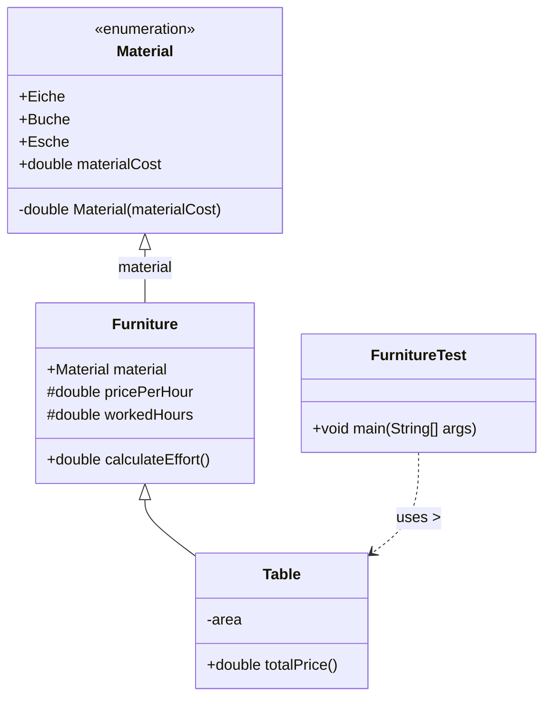

# Programmierung 1 - Serie 6

Lukas Batschelet (16-499-733)

### Stoff
- Bis zu Kapitel 9
- Fokus: Aggregation, Schnittstellen, Vererbung

### Allgemeine Informationen zur Abgabe
- Die Abgabe erfolgt online auf ILIAS.
- Quellcode zu den Implementationsaufgaben muss als \*.zip Datei abgegeben werden. Exportieren Sie hierzu Ihr Projekt direkt aus Eclipse. Quellcode, den wir nicht kompilieren können, wird nicht akzeptiert.
- Arbeit in Zweiergruppen: Geben Sie jeweils nur ein Exemplar der Lösung pro Gruppe ab. Geben Sie in der Quellcode-Datei die Namen und Matrikelnummern beider Gruppenmitglieder in den ersten beiden Zeilen als Kommentar an.
- Vorbesprechung: 17.11.2023
- Abgabe: 01.12.2023 13:00

## Implementationsaufgaben

### 1. 

Laden Sie von ILIAS die Datei `Book.java` herunter (→ Serie 6 Vorlagen → Aufgabe 1) (verwenden Sie nicht Ihre Datei aus Serie 3).
Schreiben Sie eine Klasse `Order` für Buchbestellungen. Ein `Order`-Objekt soll aus einer id, einem Kundennamen `customerName`, einer Kundenadresse `customerAddress` und beliebig vielen `Book`-Objekten bestehen. Zudem soll die Klasse `Order` die Methoden `toString()` und `addBook(...)` enthalten.

Schreiben Sie zudem einen Konstruktor `Order()`, der die Instanzvariable `id` automatisch so initialisiert, dass das erste `Order`-Objekt die id 1, das zweite die id 2, das dritte die id 3 usw. erhält. Tipp: verwenden Sie eine static-Variable.

Verwenden Sie anschließend die gegebene Klasse `Test` (ILIAS: Übungen → Serie 6 → Serie 6 Vorlagen → Aufgabe 1) um Ihre Klasse `Order` zu testen. Die Ausgabe von `Test` soll exakt so aussehen:

```

Order id: 1, Customer: Sophie Muster, Mittelstrasse 10, 3011 Bern
1, Homo Faber, Max Frisch, 01.01.1957
2, Harry Potter, J.K. Rowling, 25.07.2000
3, Krieg und Frieden, Leo Tolstoi, 24.01.1867
4, Freedom, Jonathan Franzen, 08.06.2010
4, Freedom, Jonathan Franzen, 08.06.2010
```

### Hinweise:

- Programmieren Sie nur Getter und Setter, die tatsächlich verwendet werden.
- Die Klasse `Test` darf nicht verändert werden.

### 2.

Laden Sie von ILIAS die Datei `Store.java` und `Book.java` (nicht dasselbe `Book.java` wie in Teilaufgabe 1) herunter. Das Programm `Store` verfügt über ein Menü, anhand dessen man neue Bestellung erfassen kann. Bestellungen bestehen aus (beliebig vielen) Büchern, DVDs und CDs:
```
=============================================================
| 1. Create a new order 2. Show all registered articles |
| 3. Show all orders 9. Exit |
=============================================================
What do you want to do? 1
1 (Book) Die Blechtrommel, by Guenter Grass, 1959, 29 CHF
3 (Book) L’Etranger, by Albert Camus, 1942, 25 CHF
4 (DVD) Casablanca, 1942, 29 CHF
6 (CD) Nirvana, Nevermind, 1991, 19 CHF
8 (CD) Britney Spears, ...Baby One More Time, 1999, 50 CHF
Enter id of ordered article (press x when done): 6
Successfully added: 6 (CD) Nirvana, Nevermind, 1991, 19 CHF
Enter id of ordered article (press x when done): 4
Successfully added: 4 (DVD) Casablanca, 1942, 29 CHF
Enter id of ordered article (press x when done): x
Enter the customer’s name: Susi Meier
Enter the customer’s address: Mittelstrasse 10, 3011 Bern
```
Ihre Aufgabe ist es, dafür zu sorgen, dass das Programm `Store` einwandfrei funktioniert. `Store` selbst darf nicht verändert werden.

Sie müssen also folgende Klassen und Schnittstellen programmieren:

1. Eine Schnittstelle `IArticle`, die die folgenden Methoden definiert: `int getId()`, `int getPrice()` und `String getDescription()`. Passen Sie die Klasse `Book` derart an, dass sie diese Schnittstelle implementiert.
2. Schreiben Sie Klassen `DVD` und `CD`, die beide das `IArticle` implementieren. `CD` soll einen Interpreten statt eines Autors und ansonsten die gleichen Attribute haben wie `Book`, wogegen `DVD` kein Feld `author` haben soll.
3. Passen Sie die Klasse aus Aufgabe 1 an. Welche Methoden die Klasse `Order` bereitstellen muss, können Sie der Klasse `Store` entnehmen. Insbesondere muss `Order` eine Methode `getOrderedArticles()` besitzen. Definieren sie dessen Rückgabetyp als `Iterable<IArticle>`.
4. Zeichnen Sie ein UML-Klassendiagramm aller involvierten Klassen und Schnittstellen.

### 3.

Sie sollen für eine Firma, welche Möbel herstellt, ein System entwickeln. Die Firma will sehen, ob sich dieses System bewährt, deshalb soll zunächst nur die Preisberechnung für die Tische implementiert werden. Falls die Firmenleitung zufrieden ist, sollen mehr Möbelstücke und mehr Funktionalitäten integriert werden. Implementieren Sie für dieses System `Furniture.java`, `Material.java` und `Table.java` nach dem folgenden UML-Diagramm (FurnitureTest.java ist auf Ilias verfügbar):



Anweisungen:
1. Die Klassen sollen nach diesem UML-Diagramm implementiert werden ohne zusätzliche Variablen oder Methoden zu verwenden.
2. Vergeben Sie jedem Objekt in der Aufzählung einen anderen Preis pro Quadratmeter (speichern Sie diese Information in einer Instanzvariablen )
3. Erstellen Sie einen passenden Konstruktor für `Furniture` und `Table`. Der Konstruktor von `Table` soll dabei den Konstruktor von `Furniture` verwenden.
4. Die Variable `pricePerHour` gibt die Kosten pro Stunde an für die Anfertigung des Möbelstückes. `workedHours` gibt die Anzahl Stunden an, welche nötig waren, um das Möbelstück fertigzustellen. Die Methode `calculateEffort()` soll nun den Aufwand für die Herstellung eines Möbelstückes berechnen.
5. Da in der Aufwandsberechnung noch nicht der Materialpreis inbegriffen ist, soll in der Methode `totalPrice()` zunächst mithilfe der Methode aus `Furniture` den Preis für den Aufwand berechnet werden. Danach wird der Materialpreis berechnet (gegeben durch multipliziert mit dem Quadratmeterpreis des Materials) und zum Aufwand dazu addiert.
